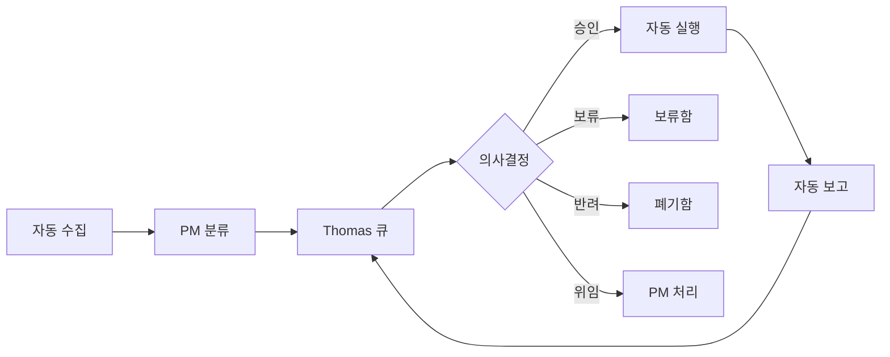

# 🏭 자동화된 의사결정 컨베이어벨트 시스템

## 📌 핵심 개념
**Thomas는 의사결정만, PM은 컨베이어벨트 운영만**

---

## 🔄 자동 의사결정 파이프라인



---

## 🏷️ 의사결정 라벨 시스템

### 결재 상태 라벨
```yaml
decision-labels:
  pending:
    - "decision:pending" 🟡  # 결재 대기
    - "decision:urgent" 🔴   # 긴급 결재
    - "decision:scheduled" 🔵 # 예정된 결재
    
  completed:
    - "decision:approved" ✅  # 승인
    - "decision:rejected" ❌  # 반려
    - "decision:delegated" 🤝 # 위임
    - "decision:deferred" ⏸️  # 보류
    
  final:
    - "decision:merged" 🎯    # 최종 완료
    - "decision:archived" 📦  # 보관
```

### 우선순위 라벨
```yaml
priority-labels:
  - "p0:critical" 🚨  # 즉시 결재 필요
  - "p1:high" 🔥      # 오늘 내 결재
  - "p2:medium" 📌    # 이번 주 결재
  - "p3:low" 📎       # 시간 날 때
```

---

## 🤖 PM 자동화 봇

### 1. 안건 수집 봇
```python
class AgendaCollector:
    """30분마다 자동으로 안건 수집"""
    
    def run_every_30_minutes(self):
        # 1. 새로운 이슈 수집
        new_issues = self.collect_new_issues()
        
        # 2. 완료된 작업 수집
        completed_tasks = self.collect_completed_tasks()
        
        # 3. 블로커 수집
        blockers = self.collect_blockers()
        
        # 4. 정기 보고 수집
        reports = self.collect_scheduled_reports()
        
        # 5. Thomas 큐에 추가
        self.add_to_thomas_queue({
            "new": new_issues,
            "completed": completed_tasks,
            "blockers": blockers,
            "reports": reports
        })
```

### 2. 의사결정 큐 관리자
```python
class DecisionQueueManager:
    """Thomas에게 순서대로 안건 제시"""
    
    def __init__(self):
        self.queue = PriorityQueue()
        self.current_item = None
        
    def get_next_decision(self):
        """다음 결재 안건 자동 제시"""
        
        if self.current_item and self.current_item.status == "pending":
            return None  # 이전 건 처리 중
        
        # 우선순위별로 정렬된 안건 가져오기
        next_item = self.queue.get()
        
        # Thomas에게 제시
        decision_request = f"""
        ━━━━━━━━━━━━━━━━━━━━━━━━━━━━━━━━━━━
        📋 결재 요청 #{next_item.number}
        
        유형: {next_item.type}
        우선순위: {next_item.priority}
        제목: {next_item.title}
        
        요약:
        {next_item.summary}
        
        PM 의견:
        {next_item.pm_recommendation}
        
        결정 옵션:
        [A] 승인 (Approve)
        [D] 위임 (Delegate) 
        [H] 보류 (Hold)
        [R] 반려 (Reject)
        [M] 수정 (Modify)
        
        다음 안건: {self.queue.qsize()}개 대기 중
        ━━━━━━━━━━━━━━━━━━━━━━━━━━━━━━━━━━━
        """
        
        self.current_item = next_item
        return decision_request
```

### 3. 자동 실행 엔진
```python
class AutoExecutionEngine:
    """결재 후 자동 실행"""
    
    def process_decision(self, item, decision):
        """Thomas 결정에 따른 자동 처리"""
        
        # 1. 라벨 업데이트
        self.update_labels(item, decision)
        
        # 2. 결정별 자동 실행
        if decision == "APPROVED":
            self.execute_approved(item)
            self.schedule_completion_check(item)
            
        elif decision == "DELEGATED":
            self.delegate_to_pm(item)
            
        elif decision == "DEFERRED":
            self.add_to_deferred_queue(item)
            self.schedule_reminder(item, days=3)
            
        elif decision == "REJECTED":
            self.archive_rejected(item)
            
        elif decision == "MODIFIED":
            self.request_modification(item)
            
        # 3. 다음 안건 자동 제시
        self.queue_manager.get_next_decision()
```

---

## 📊 실시간 대시보드

### Thomas 전용 의사결정 뷰
```javascript
const ThomasDecisionDashboard = {
  // 현재 안건
  current: {
    item: "PR #38: 100 AI 조직 시스템",
    type: "기획안 승인",
    urgency: "medium",
    waiting_time: "10분"
  },
  
  // 대기 중인 안건
  queue: {
    urgent: 2,    // 긴급
    today: 5,     // 오늘 처리
    this_week: 12, // 이번 주
    total: 19
  },
  
  // 오늘의 결재 현황
  today_stats: {
    approved: 8,
    delegated: 3,
    deferred: 2,
    rejected: 1,
    pending: 5
  },
  
  // 자동 처리 현황
  automation: {
    auto_executed: 45,
    in_progress: 12,
    completed: 33,
    failed: 0
  }
};
```

---

## 🔄 일일 루틴 (완전 자동화)

### 오전 9:00 - 일일 브리핑
```python
def daily_briefing():
    """자동 일일 브리핑 생성"""
    
    briefing = f"""
    ☀️ Good Morning, Thomas!
    
    📊 어제 실적
    - 완료: 23개 작업
    - 승인: 15개 결재
    - 블로커: 2개 해결
    
    📌 오늘 예정
    - 긴급 결재: 3건
    - 정기 검토: 5건
    - 마일스톤: M2 완료 예정
    
    ⚠️ 주의 필요
    - PR #42: 보안 이슈 검토 필요
    - 예산 80% 소진
    
    첫 번째 안건을 보시겠습니까? [Y/N]
    """
    
    return briefing
```

### 30분마다 - 자동 안건 수집
```python
@schedule.every(30).minutes.do
def collect_and_queue():
    collector.run()
    if queue.has_urgent():
        notify_thomas("🚨 긴급 결재 대기 중")
```

### 매시간 - 진행 상황 체크
```python
@schedule.every().hour.do
def progress_check():
    # 블로커 확인
    blockers = check_blockers()
    if blockers:
        add_to_urgent_queue(blockers)
    
    # 지연 작업 확인
    delayed = check_delayed_tasks()
    if delayed:
        add_to_thomas_queue(delayed)
```

### 오후 6:00 - 일일 마감
```python
def daily_closing():
    """자동 일일 마감 보고"""
    
    report = f"""
    🌙 Daily Closing Report
    
    ✅ 오늘 완료
    - 결재: {today_decisions} 건
    - 작업: {completed_tasks} 개
    - PR 머지: {merged_prs} 개
    
    📋 내일 예정
    - 대기 결재: {pending_decisions} 건
    - 예정 작업: {scheduled_tasks} 개
    
    자동으로 내일 일정이 준비됩니다.
    """
    
    return report
```

---

## 🎯 구현 예시

### 실제 동작 시나리오
```
09:00 - 🤖 PM: "좋은 아침입니다. 긴급 결재 3건 있습니다."
09:01 - 👤 Thomas: "시작"
09:02 - 🤖 PM: "PR #38: 100 AI 시스템 승인 요청"
09:03 - 👤 Thomas: "A" (승인)
09:03 - 🤖 자동: 라벨 변경, 작업 시작, 다음 안건 제시
09:04 - 🤖 PM: "Issue #41: 예산 증액 요청"
09:05 - 👤 Thomas: "H" (보류)
09:05 - 🤖 자동: 보류함 이동, 3일 후 리마인더, 다음 안건
09:06 - 🤖 PM: "PR #42: 버그 수정 완료 보고"
09:07 - 👤 Thomas: "D" (위임)
09:07 - 🤖 자동: PM 권한 처리, 자동 머지

... Thomas는 결정만, 나머지는 자동 ...

18:00 - 🤖 PM: "오늘 19건 처리 완료. 내일 안건 준비됐습니다."
```

---

## 📦 GitHub Actions 자동화

### 라벨 기반 자동 실행
```yaml
name: Decision Automation

on:
  issues:
    types: [labeled]
  pull_request:
    types: [labeled]

jobs:
  process-decision:
    if: startsWith(github.event.label.name, 'decision:')
    runs-on: ubuntu-latest
    steps:
      - name: Process Thomas Decision
        run: |
          case "${{ github.event.label.name }}" in
            "decision:approved")
              echo "Starting approved workflow..."
              # 자동 실행 시작
              ;;
            "decision:delegated")
              echo "Delegating to PM..."
              # PM 자동 처리
              ;;
            "decision:deferred")
              echo "Adding to deferred queue..."
              # 보류함 이동
              ;;
          esac
```

---

## 🚀 즉시 구현 가능

### 1. 라벨 생성
```bash
# 결재 상태 라벨
for label in pending urgent approved rejected delegated deferred merged; do
  gh label create "decision:$label" -R ihw33/ai-orchestra-v02
done

# 우선순위 라벨  
for i in {0..3}; do
  gh label create "p$i" -R ihw33/ai-orchestra-v02
done
```

### 2. 자동 큐 시작
```bash
# PM 봇 시작
python pm_automation_bot.py --mode conveyor

# 대시보드 시작
python decision_dashboard.py --port 8080
```

이제 **Thomas는 의사결정만**, PM은 **컨베이어벨트만 관리**합니다! 🏭