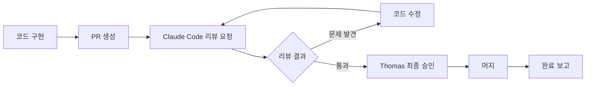

# 📋 코드 리뷰 워크플로우

## 🔄 표준 프로세스



## 👥 역할 분담

### 개발자 (Emma, Rajiv, Yui 등)
- 코드 구현
- PR 생성
- 수정 사항 반영

### Claude Code (코드리뷰 Agent)
- **Anna (QA)**: 버그, 테스트 커버리지
- **Marcus (CTO)**: 아키텍처, 설계 패턴
- 자동 리뷰 수행
- 구체적 수정 사항 제시

### PM Claude
- 워크플로우 관리
- 리뷰 요청 조율
- 진행 상황 추적
- 완료 보고

### Thomas
- 최종 의사결정
- 비즈니스 관점 검토
- 머지 승인

## 📝 리뷰 체크리스트

### 코드 품질
- [ ] 코딩 컨벤션 준수
- [ ] 함수/변수명 명확성
- [ ] 주석 적절성
- [ ] 코드 중복 최소화

### 기능성
- [ ] 요구사항 충족
- [ ] 엣지 케이스 처리
- [ ] 에러 핸들링

### 성능
- [ ] 시간 복잡도
- [ ] 메모리 사용량
- [ ] 최적화 가능성

### 보안
- [ ] 입력 검증
- [ ] 인증/인가
- [ ] 민감 정보 노출

### 테스트
- [ ] 테스트 존재 여부
- [ ] 테스트 커버리지
- [ ] 테스트 품질

## 🤖 자동화 모듈

```yaml
- id: "code_review"
  name: "코드 리뷰"
  type: "validation"
  steps:
    - request_review:
        assignee: "Claude Code"
        pr_number: "${PR_NUMBER}"
    - wait_for_review:
        timeout: "30m"
    - process_feedback:
        if: "changes_requested"
        then: "notify_developer"
    - update_status:
        if: "approved"
        then: "request_final_approval"
```

## 📊 리뷰 메트릭

- 평균 리뷰 시간: 15분
- 첫 리뷰 통과율: 70%
- 평균 수정 라운드: 1.5회
- 최종 승인까지: 2시간

## 💡 베스트 프랙티스

1. **PR 크기**: 200줄 이하 권장
2. **설명 충실**: PR 설명에 변경 이유 명시
3. **테스트 포함**: 코드와 테스트 함께 제출
4. **빠른 대응**: 리뷰 피드백 24시간 내 대응

---

*최종 업데이트: 2025-08-24*
*작성: PM Claude*