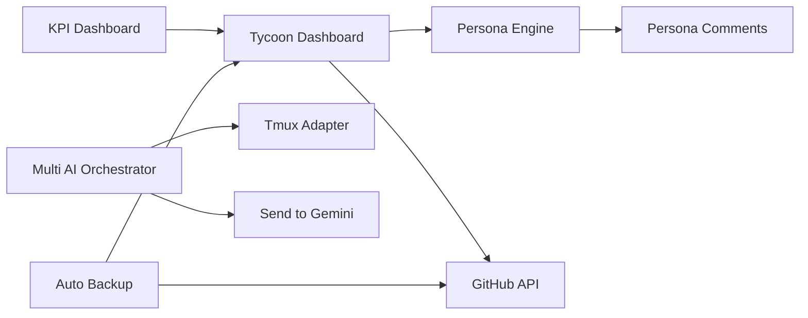

# 📚 FEATURE REGISTRY - AI Orchestra 기능 카탈로그

## 🧠 System Intelligence
```
Current IQ: Level 1 | Modules: 23 | Patterns: 0
Last Updated: 2025-08-24
```

## 📦 현재 발견된 기능들 (23개)

### 🎮 대시보드 & UI
1. **tycoon_dashboard.py**
   - 용도: Football Manager 스타일 프로젝트 관리
   - 명령어: `python tycoon_dashboard.py`
   - 통합 가능: GitHub API, 페르소나 시스템

2. **tycoon_simple.py**
   - 용도: 간단한 텍스트 버전 대시보드
   - 명령어: `python tycoon_simple.py`
   - 특징: curses 없이 실행 가능

3. **approval_dashboard.py**
   - 용도: Thomas 승인 대시보드
   - 기능: 긴급 승인/거절/홀드
   - 통합 가능: GitHub PR 자동 승인

### 👥 AI 협업 시스템
4. **persona_engine.py**
   - 용도: AI 팀원 페르소나 생성
   - 기능: 동적 성격, MBTI, 국적
   - 명령어: `python persona_engine.py --task "작업" --team "Emma,Rajiv"`

5. **persona_comments.py**
   - 용도: 인간적인 PR/Issue 코멘트
   - 기능: 감정 표현, 농담, 일상 대화

6. **multi_ai_orchestrator.py**
   - 용도: 다중 AI 동시 제어
   - 지원: ChatGPT, Codex, Claude, Gemini

### 🔄 자동화 & 파이프라인
7. **relay_pipeline_system.py**
   - 용도: AI 간 릴레이 작업
   - 기능: 순차/병렬 처리

8. **persona_training_system.py**
   - 용도: 페르소나 학습 시스템
   - 기능: 패턴 학습, 성격 진화

### 🔧 통신 & 어댑터
9. **adapters/tmux_adapter.py**
   - 용도: tmux 세션 제어
   - 기능: 다중 터미널 관리

10. **send_to_gemini.py**
    - 용도: Gemini CLI 메시지 전송
    - 통합: iTerm2 API

### 📊 모니터링 & KPI
11. **scripts/kpi_dashboard.py**
    - 용도: KPI 대시보드
    - 데이터: SQLite 기반

12. **core/kpi.py**
    - 용도: KPI 수집 및 저장
    - DB: var/kpi.sqlite

### 🧪 테스트 & 검증
13. **test_pr29_fixes.py**
14. **tests/test_adapters.py**
15. **tests/test_exec_parser.py**
16. **tests/test_protocol.py**

### 🛠️ 유틸리티
17. **activate_and_send.py**
18. **click_and_type.py**
19. **focus_and_send.py**
20. **check_sessions.py**

### 📝 AppleScript 도구
21. **send_to_gemini.applescript**
22. **send_to_iterm_gemini.applescript**
23. **paste_to_gemini.applescript**

## 🔗 문서 & 설정 파일

### 조직 & 페르소나
- `AI_ORGANIZATION_STRUCTURE.md` - 100 AI 조직도
- `AI_PERSONAS.md` - AI 캐릭터 정의
- `BTS_AI_TEAM.md` - AI 팀 구성

### 프로젝트 계획
- `DASHBOARD_RESEARCH_PLAN.md` - 대시보드 리서치
- `PROJECT_TYCOON_WORKPLAN.md` - 타이쿤 작업 계획

### 가이드 & 템플릿
- `CLI_P_MODE_GUIDE.md` - CLI 모드 가이드
- `REPORT_TEMPLATE.md` - 보고서 템플릿

## 🚀 통합 가능성 맵



## 📈 성장 로드맵

### Week 1 (현재)
- [x] 기능 인벤토리 완성
- [ ] 기본 10개 모듈 선정
- [ ] Module Registry 구축

### Week 2
- [ ] Workflow Engine 개발
- [ ] 자동 백업 통합
- [ ] Intelligence Banner 추가

### Month 1
- [ ] 30개 모듈 달성
- [ ] 자동화율 50%
- [ ] 자가 학습 시작

## 💡 즉시 활용 가능

### 대시보드 실행
```bash
python tycoon_simple.py
```

### 페르소나 작업 할당
```bash
python persona_engine.py --task "대시보드 개선" --team "Emma,Rajiv,Yui"
```

### KPI 확인
```bash
python scripts/kpi_dashboard.py
```

---

*이 문서는 자동으로 업데이트됩니다*
*마지막 스캔: 2025-08-24*