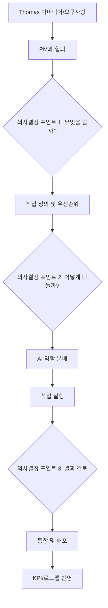

# 🤝 PM-Thomas 의사결정 플로우

## 📌 핵심 원칙
**모든 작업은 Thomas의 협의와 의사결정을 거쳐야 실행됨**

---

## 🔄 전체 의사결정 플로우



---

## 📋 Phase 1: 작업 정의 (Thomas + PM)

### 1.1 협의 세션
```yaml
participants:
  - Thomas (최종 결정권자)
  - PM Claude (제안 및 조정)

agenda:
  1. 현재 상황 브리핑 (5분)
  2. 새로운 요구사항 논의 (10분)
  3. 우선순위 결정 (5분)
  4. 실행 계획 승인 (5분)

outputs:
  - DECISION_LOG.md
  - APPROVED_TASKS.md
  - PRIORITY_MATRIX.md
```

### 1.2 작업 분류 시스템
```python
class TaskClassifier:
    """Thomas 승인을 위한 작업 분류"""
    
    TASK_CATEGORIES = {
        "CRITICAL": {
            "description": "즉시 Thomas 승인 필요",
            "approval_time": "immediate",
            "teams": ["senior_devs", "architects"]
        },
        "FEATURE": {
            "description": "새 기능 - Thomas 사전 승인",
            "approval_time": "plan_mode",
            "teams": ["product", "dev", "design"]
        },
        "BUG": {
            "description": "버그 수정 - 사후 보고",
            "approval_time": "post_execution",
            "teams": ["qa", "dev"]
        },
        "IMPROVEMENT": {
            "description": "개선 사항 - 주간 검토",
            "approval_time": "weekly_review",
            "teams": ["any"]
        }
    }
    
    def classify_and_route(self, task):
        category = self.analyze_task(task)
        approval_needed = self.TASK_CATEGORIES[category]["approval_time"]
        
        if approval_needed == "immediate":
            return self.request_thomas_approval(task)
        elif approval_needed == "plan_mode":
            return self.schedule_planning_session(task)
        else:
            return self.add_to_review_queue(task)
```

---

## 👥 Phase 2: AI 역할 분배 결정

### 2.1 작업별 AI 할당 매트릭스
```yaml
decision_matrix:
  backend_api:
    primary: ["codex", "backend_lead"]
    support: ["db_expert", "security"]
    review: ["claude_architect"]
    thomas_approval: "required for API design"
    
  frontend_ui:
    primary: ["gemini", "frontend_lead"]
    support: ["ux_designer", "css_expert"]
    review: ["design_director"]
    thomas_approval: "required for UX flow"
    
  infrastructure:
    primary: ["devops_lead", "sre"]
    support: ["security", "performance"]
    review: ["cto_ai"]
    thomas_approval: "required for cost > $100"
    
  data_pipeline:
    primary: ["data_engineer", "analyst"]
    support: ["backend", "ml_engineer"]
    review: ["data_lead"]
    thomas_approval: "required for schema changes"
```

### 2.2 Thomas 승인 플로우
```python
class ApprovalFlow:
    def request_approval(self, task, ai_assignments):
        """Thomas에게 승인 요청"""
        
        approval_request = f"""
        🎯 승인 요청
        
        작업: {task.title}
        카테고리: {task.category}
        
        제안하는 AI 할당:
        - 주담당: {ai_assignments['primary']}
        - 지원: {ai_assignments['support']}
        - 검토: {ai_assignments['review']}
        
        예상 소요시간: {task.estimated_hours}h
        예상 비용: ${task.estimated_cost}
        
        승인 옵션:
        [A] Approve - 제안대로 진행
        [M] Modify - 수정 후 진행
        [R] Reject - 보류
        [D] Delegate - PM 재량
        """
        
        return self.present_to_thomas(approval_request)
```

---

## 📊 Phase 3: 실행 모니터링

### 3.1 실시간 대시보드
```javascript
const ExecutionDashboard = {
  // Thomas가 보는 메인 뷰
  thomas_view: {
    sections: {
      decisions_pending: {
        count: 3,
        items: [
          "API 설계 승인",
          "데이터베이스 마이그레이션",
          "UI 리디자인"
        ]
      },
      
      in_progress: {
        teams_active: 15,
        tasks_running: 42,
        completion_rate: "73%"
      },
      
      blockers: {
        critical: 1,
        high: 2,
        medium: 5
      }
    }
  },
  
  // 의사결정 지원 정보
  decision_support: {
    recommendations: "PM 제안사항",
    risk_analysis: "위험 요소 분석",
    alternative_options: "대안 제시"
  }
};
```

### 3.2 진행 상황 보고
```python
class ProgressReporter:
    def generate_thomas_report(self):
        """Thomas 전용 보고서"""
        
        return {
            "executive_summary": self.get_one_page_summary(),
            "decisions_made": self.list_thomas_decisions(),
            "pending_approvals": self.get_pending_items(),
            "team_performance": self.calculate_team_metrics(),
            "recommendations": self.pm_recommendations()
        }
    
    def alert_thomas(self, issue):
        """긴급 상황 알림"""
        
        if issue.severity == "CRITICAL":
            alert = f"""
            🚨 즉시 결정 필요
            
            문제: {issue.description}
            영향: {issue.impact}
            
            옵션:
            1. {issue.option_1}
            2. {issue.option_2}
            3. {issue.option_3}
            
            PM 추천: {self.pm_recommendation}
            """
            
            self.send_immediate_alert(thomas, alert)
```

---

## 📈 Phase 4: 결과 통합 및 보고

### 4.1 결과 검토 세션
```yaml
review_session:
  schedule: "작업 완료 후 30분 이내"
  
  format:
    quick_review:  # 5분
      - 완료 작업 요약
      - 주요 성과
      - Thomas 승인/거부
      
    detailed_review:  # 15분
      - 팀별 성과 분석
      - 문제점 및 개선사항
      - 다음 단계 계획
      - Thomas 의사결정
```

### 4.2 의사결정 기록
```python
class DecisionLogger:
    def log_thomas_decision(self, decision):
        """모든 Thomas 결정 기록"""
        
        record = {
            "timestamp": datetime.now(),
            "decision_type": decision.type,
            "context": decision.context,
            "options_presented": decision.options,
            "thomas_choice": decision.choice,
            "rationale": decision.rationale,
            "impact": self.calculate_impact(decision),
            "execution_result": None  # 추후 업데이트
        }
        
        # GitHub Issue에 기록
        self.create_decision_issue(record)
        
        # 결정 사항 즉시 실행
        self.execute_decision(record)
```

---

## 📊 Phase 5: KPI 및 로드맵 반영

### 5.1 KPI 업데이트
```python
class KPIManager:
    def update_after_thomas_approval(self, completed_work):
        """Thomas 승인 후 KPI 반영"""
        
        kpi_updates = {
            "velocity": self.calculate_new_velocity(),
            "quality_score": self.update_quality_metrics(),
            "automation_rate": self.calculate_automation(),
            "thomas_intervention_rate": self.track_decision_frequency()
        }
        
        # 칸반 보드 업데이트
        self.update_kanban_board(completed_work)
        
        # 로드맵 진행률 업데이트
        self.update_roadmap_progress()
        
        return kpi_updates
```

### 5.2 칸반 보드 자동 업데이트
```yaml
kanban_columns:
  backlog:
    description: "Thomas 승인 대기"
    wip_limit: unlimited
    
  ready:
    description: "Thomas 승인 완료, 시작 대기"
    wip_limit: 20
    
  in_progress:
    description: "AI 작업 중"
    wip_limit: 50
    
  review:
    description: "Thomas 검토 중"
    wip_limit: 10
    
  done:
    description: "완료 및 배포"
    wip_limit: unlimited
```

---

## 🚀 실행 예시

### 새 기능 요청 플로우
```
1. Thomas: "결제 시스템 개선 필요"
   ↓
2. PM Claude: "3가지 옵션 제안"
   - A: 전체 리팩토링 (2주)
   - B: 핵심 기능만 개선 (3일)
   - C: 임시 패치 (1일)
   ↓
3. Thomas: "B 선택, 하지만 보안 강화 추가"
   ↓
4. PM Claude: AI 할당 제안
   - Codex: 백엔드 로직
   - Gemini: 프론트엔드
   - Security AI: 보안 검토
   ↓
5. Thomas: "승인, 진행"
   ↓
6. 실행 (3일)
   ↓
7. PM Claude: "완료 보고"
   - 성공: 95%
   - 이슈: 1개 (해결됨)
   ↓
8. Thomas: "배포 승인"
   ↓
9. KPI/로드맵 자동 업데이트
```

---

## 📝 Thomas 의사결정 지원 도구

### 빠른 결정 도구
```bash
# Accept Mode (1분)
python review_session.py --mode accept

# Plan Mode (10분)  
python review_session.py --mode plan

# Step Mode (상세 검토)
python review_session.py --mode step
```

### 의사결정 템플릿
```markdown
## 결정 필요 사항
- **What**: [작업 내용]
- **Why**: [필요 이유]
- **Who**: [제안 AI 팀]
- **When**: [일정]
- **Cost**: [예상 비용/시간]

## PM 제안
- Option A: [빠른 해결]
- Option B: [균형 접근]
- Option C: [완벽 추구]

## Thomas 결정
- [ ] A 승인
- [ ] B 승인  
- [ ] C 승인
- [ ] 수정 후 승인
- [ ] 보류
```

이 시스템으로 **Thomas가 모든 핵심 의사결정**을 하면서도
**효율적으로 100 AI를 관리**할 수 있습니다! 🎯